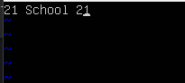
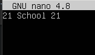
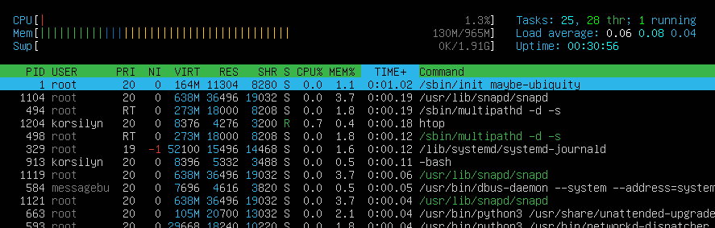
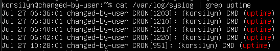

# Report of DO1 by florencm
## Part 1. Installation of the OS
### == Task ==
Install Ubuntu 20.04 Server LTS without GUI. (Use VirtualBox).

    There should be no GUI.
    Check Ubuntu version by running the command
    cat /etc/issue
    Add a screenshot of the command output to the report.


## Part 2. Creating a user
### == Task ==
Create a user other than the one created during installation. The user must be added to adm group.

    Add a screenshot of command call to create user.
    The new user must be in the output of the command:
    cat /etc/passwd
    Add a screenshot of the command output.

  


## Part 3. Setting up the OS network
### == Task ==

1. Set the machine name as user-1  
```
    To change machine name, we need to edit file /etc/hostname.  
    I used nano /etc/hostname and replaced "vm1" to "user-1"
```

2. Set the time zone corresponding to your current location.  
```
    To change timezone, we can use timedatectl:  
    timedatectl set-timezone Europe/Moscow
```
3. Output the names of the network interfaces using a console command.  
    In the report give an explanation for the presence of the lo interface.
```
    To output names of the NI, we can use next command:  
    ip l  

    lo is a loopback device. You can imagine it as a virtual network  
    device that is on all systems, even if they aren't connected to  
    any network. It has an IP address of 127.0.0.1 and can be used to  
    access network services locally.
```

4. Use the console command to get the ip address of the device you are working on from the DHCP server.  
    Decode DHCP in the report.
```
    To get the IP address, we can use next command:  
    ip a s ens3, where ens3 is my ethernet device from previous step  
    DHCP is decoded as Dynamic Host Configuration Protocol
```

5. Define and display the external ip address of the gateway (ip) and the internal IP address of the gateway, aka default ip address (gw).
```
    A default gateway is the node in a computer network using the Internet protocol  
    suite that serves as the forwarding host (router) to other networks when no other  
    route specification matches the destination IP address of a packet. 

    Gateway have two IPs. One is an external IP address assigned by for example ISP,  
    and the other an internal IP address that is only accessible within your network   

    To get gateway internal and external IP, i used:  
    ip r | grep default  
    My external IP is 10.0.2.15, internal IP is 10.0.2.2
```

6. Set static (manually set, not received from DHCP server) ip, gw, dns settings (use public DNS servers, e.g. 1.1.1.1 or 8.8.8.8).
```
    To set static ip, we need to edit /etc/netplan/00-installer-config.yaml  
    We need to:  
    Set dhcp4 to false  
    Set addresses to [ 10.0.2.15/24 ]  
    Set gateway4 to 10.0.2.2  
    Set nameservers: addresses to [ 1.1.1.1 ]  
    Save file end enter netplan apply
```

7. Reboot the virtual machine. Make sure that the static network settings (ip, gw, dns) correspond to those set in the previous point.
```
    To check settings after reboot, we need to use ip r | grep default  
    We need to ensure, that there are 'static' now  
    To check DNS server, i used:  
    systemd-resolve --show | grep "DNS Server"  
    I have 1.1.1.1 in there
```
    Describe in the report what you have done to complete all seven points (you can do it in text or with screenshots).
    Successfully ping 1.1.1.1 and ya.ru remote hosts and add a screenshot of the output command to the report. There should be "0% packet loss" phrase in command output.

  
  


## Part 4. OS Update
### == Task ==

Update the system packages to the latest version

    After updating the system packages, if you enter the update command again, a message should appear saying there are no updates.
    Add a screenshot of this message to the report.


## Part 5. Using the sudo command
### == Task ==

Allow user created in Part 2 to execute sudo command.  
  
```
    sudo allows a system administrator to delegate authority to give certain users  
    ability to run commands as root or another user  
```

    In the report explain the true purpose of sudo command (don’t write about the fact that this word is "magic" one).
    Change the OS hostname via the user created in Part 2 (using sudo).
    Add screenshot with changed hostname to the report.


## Part 6. Installing and configuring the time service
### == Task ==

Set up the automatic time synchronisation service.

    Output the time of the time zone in which you are currently located.
    The output of the following command must contain NTPSynchronized=yes:
        timedatectl show
    Add screenshots of the correct time and command output to the report.

  

## Part 7. Installing and using text editors
### == Task ==

Install VIM text editor (+ any two others if you like NANO, MCEDIT, JOE etc.)

Using each of the three selected editors, create a test_X.txt file, where X is the name of the editor in which the file is created. Write your nickname in it, close the file and save the changes.

    Add screenshots to the report:
        Of each editor with the contents of the file before closing.
    Write down in the report what you have done to exit with the changes saved.

  
To exit with the changes saved, you need to print :wq in command mode  
  
To exit with the changes saved, you need to press ctrl+o and ctrl+x  
  
To exit with the changes saved, you need to press ctrl+s and ctrl+q

Using each of the three selected editors, open the file for editing, edit the file by replacing the nickname with the "21 School 21" string, close the file without saving the changes.

    Add screenshots to the report:
        Of each editor with the contents of the file after editing.
    Write down in the report what you have done to exit without saving the changes.

  
To exit without the changes saved, you need to print :q! in command mode  
  
To exit without the changes saved, you need to press ctrl+x and choose not to save buffer  
  
To exit without the changes saved, you need to press ctrl+q and choose not to save file

Using each of the three selected editors, edit the file again (similar to the previous point) and then master the functions of searching through the contents of a file (a word) and replacing a word with any other one.

    Add screenshots to the report:
        Of each editor with word search results.
        Of each editor with commands entered to replace a word with another.

  
  
  
  
  
  

## Part 8. Installing and basic setup of the SSHD service
### == Task ==

Install the SSHd service.  
```
apt-get install ssh  
```
Add an auto-start of the service whenever the system boots.  
```
systemctl enable ssh  
```
Reset the SSHd service to port 2022.  
```
To do this, I edited /etc/ssh/sshd_config and changed  
#Port 22 to  
Port 2022  
```
Show the presence of the sshd process using the ps command. To do this, you need to match the keys to the command.

    Explain in the report the meaning of the command and each key in it.

  
```
ps shows processes in system. -u root show processes, that started from root/systemd daemon  
```
Reboot the system.

    Describe in the report what you have done to complete all five points (you can do this in text or with screenshots).
    The output of the netstat -tan command should contain
    tcp 0 0.0.0.0:2022 0.0.0.0:* LISTEN
    (if there is no netstat command, it needs to be installed)
    Add a screenshot of the command output to the report.
    Explain the meaning of the -tan keys, the value of each output column, the value 0.0.0.0. in the report.

  
```
-tan show only connected tcp connection, and n flag don't resolve name (ahows only numeric address)  
Proto is used protocol, recv-q and send-q is count of bytes received/sended  
Local address is inner address, Foreign address is external address  
State is state of socket  
0.0.0.0 means that this is lo socket, it listens itself on same vm
```

## Part 9. Installing and using the top, htop utilities
### == Task ==

Install and run the top and htop utilities.

    From the output of the top command determine and write in the report:
        uptime: 14 min
        number of authorised users: 1 user
        total system load: 0.20
        total number of processes: 96 processes
        cpu load: 3.6%
        memory load: 127.6 mb
        pid of the process with the highest memory usage: 1
        pid of the process taking the most CPU time: 1103
    Add a screenshot of the htop command output to the report:
        sorted by PID, PERCENT_CPU, PERCENT_MEM, TIME
        filtered for sshd process
        with the syslog process found by searching
        with hostname, clock and uptime output added

  
  
  
  
  
  
  

## Part 10. Using the fdisk utility
### == Task ==

Run the fdisk -l command.  
    In the report write the name of the hard disk, its capacity and number of sectors, and also the swap size.
```
    /dev/sda, 20 GiB, 41943040 sectors, 0 MiB swap size
```

## Part 11. Using the df utility
### == Task ==

Run the df command.

    In the report write for the root partition (/):
        partition size: 20463184 bytes
        space used: 4899796 bytes
        space free: 14498584 bytes
        percentage used: 26%
    Determine and write the measurement unit in the report.

Run the df -Th command.

    In the report write for the root partition (/):
        partition size: 20G
        space used: 4.7G
        space free: 14G
        percentage used: 26%
        system type: ext4
    Determine and write the file system type for the partition in the report.

## Part 12. Using the du utility
### == Task ==

Run the du command.

Output the size of the /home, /var, /var/log folders (in bytes, in human readable format)  
```
/home: 108K  
/var: 765M  
/var/log: 35M  
```
  
Output the size of all contents in /var/log (not the total, but each nested element using *)

    Add screenshots with the output of all used commands to the report.
  
## Part 13. Installing and using the ncdu utility
### == Task ==

Install the ncdu utility.

Output the size of the /home, /var, /var/log folders.

    The size should be approximately the same as in Part 12.

    Add screenshots of the used commands to the report.
  
  
  
## Part 14. Working with system logs
### == Task ==

Open for viewing:

1. /var/log/dmesg  
2. /var/log/syslog  
3. /var/log/auth.log  

    Write the last successful login time, user name and login method in the report.  
    ```
        3:54:26, korsilyn, user:session  
    ```
    Restart SSHd service.  
    Add a screenshot of the service restart message to the report (search for it in the logs).  


## Part 15. Using the CRON job scheduler
### == Task ==

Using the job scheduler, run the uptime command in every 2 minutes.  
```
I used crontab -e and added new job: */2 * * * * uptime  
```
    Find lines in the system logs (at least two within a given time range) about the execution.
    Display a list of current jobs for CRON.
    Add screenshots of the execution lines and the list of current tasks to the report.  

  
  

Remove all tasks from the job scheduler.

    Add a screenshot of the list of current tasks for CRON to the report.


